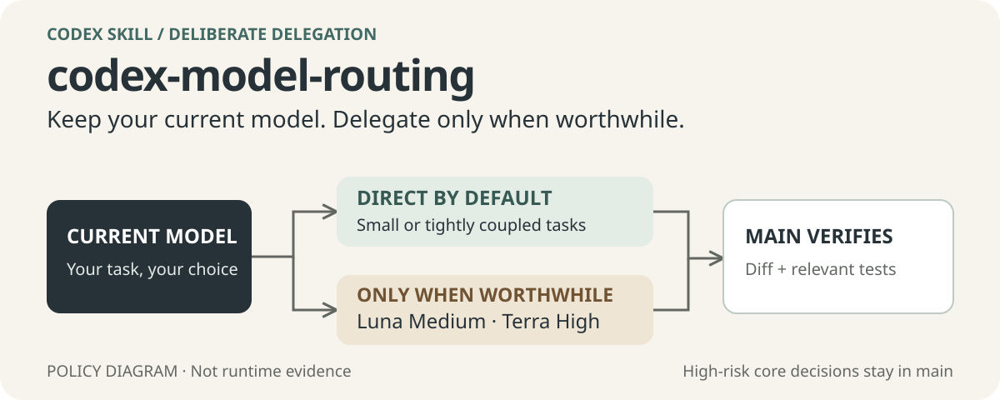

# codex-model-routing

[简体中文](./README.zh-CN.md)

<p align="center">
  <picture>
    <source media="(max-width: 600px)" srcset="./docs/readme/assets/hero.mobile.svg">
    
  </picture>
</p>

An auditable Codex Skill for setting up a deliberate model-routing policy: a Sol Max main thread plans, routes, and verifies; Luna Medium takes clear, repeatable work; Terra High takes everyday implementation. It is a configuration and behavior-rule companion—not Codex-native automatic switching of the root model.

## Evidence before promises

The included payload exposes three deliberate modes: `audit`, `plan`, and `apply`.

- `audit` inspects the managed model fields and the routing block without writing.
- `plan` shows the candidate diff without writing.
- `apply` requires an explicit user-level confirmation flag, writes atomically, and records original files plus a SHA-256 manifest in `backups/` when there is a change.

It stops on malformed TOML, duplicate or array-form root `[agents]` tables, conflicting routing markers, and other unsafe states. It preserves unknown configuration rather than replacing the whole file.

## How routing really works

Codex configuration can set defaults for subagent model and reasoning effort. Actual subagent dispatch is a behavior decision: Codex dispatches when directly asked, or when applicable project or Skill instructions require it. An explicit `spawn` model/reasoning override takes precedence over defaults.

This Skill writes the accompanying `AGENTS.md` routing rule so that the model choice is observable and reviewable. It does not claim automatic routing telemetry, a release workflow, or a runtime dispatch that has not been independently observed.

**Direct first, route only when worthwhile.** A lookup, small edit, local review, or one test run stays in the main thread. Reading, editing, and testing one small change—even across related files—is one task, not a reason to split. Delegate only a bounded, independently verifiable work item with genuine parallel-work or independent-review value that exceeds handoff and integration cost. When unsure, work directly. Respect explicit requests to use or avoid subagents; do not add a review just to meet a quota. Small direct tasks need no routing ceremony.

The division follows OpenAI's current guidance for [Sol, Terra, Luna, Max, and Ultra](https://learn.chatgpt.com/docs/models), while the dispatch behavior and override precedence come from the official [Subagents](https://learn.chatgpt.com/docs/agent-configuration/subagents) documentation. Supported configuration keys must always be checked against the current [Configuration Reference](https://learn.chatgpt.com/docs/config-file/config-reference).

| Work shape | Intended handling |
| --- | --- |
| Simple coherent task, tightly coupled serial work, or unclear delegation value | Main thread directly; no forced split |
| Architecture, security, migration, data-loss, production risk, or ambiguity | Keep the core decision in the main thread |
| Clear, repeatable research, organization, documentation, or mechanical work that passes the delegation gate | Luna Medium |
| Everyday implementation, integration, debugging, or review that passes the delegation gate | Terra High |
| Non-high-risk debugging that still passes the gate, after a documented Terra High failure | Escalate Terra once to XHigh, then re-evaluate |

## Install and take the first safe action

Ask your Agent: **Please install this Skill: https://github.com/MuziGeek/codex-model-routing**.

Or install with the optional Node.js-based installer (Node.js is not a runtime dependency of this Skill):

```text
npx skills add MuziGeek/codex-model-routing --skill codex-model-routing
```

Add `--list` to check discovery without installing. If an installer is unavailable, manually copy the whole `codex-model-routing` payload directory into a Codex-discoverable Skill location.

Then begin with a read-only audit from the installed Skill directory:

The script requires Python 3.11+. Below, `python` means a verified interpreter; check `py -3` on Windows or `python3` on macOS/Linux, or use the interpreter's full path.

```text
python scripts/codex_model_routing.py --codex-home <Codex Home> audit
```

`CODEX_HOME` is used when set; otherwise the script uses the current user's `.codex` directory. Supplying `--codex-home` is useful for an isolated test directory.

## Plan before apply

For a behavior-only update, preserve the user's selected main model and all configuration bytes with `--rules-only`. It manages only the paired `AGENTS.md` block, backs up that file, and does **not** read or validate `config.toml`:

```text
python scripts/codex_model_routing.py --codex-home <Codex Home> --rules-only plan
python scripts/codex_model_routing.py --codex-home <Codex Home> --rules-only apply --confirm-user-level-change
```

The full mode below installs the Sol Max preset and requires model compatibility checks. Do not use it merely to update dispatch behavior when a different main model has been selected.

Only use a write after reviewing the current plan and receiving explicit authorization for this user-level change:

```text
python scripts/codex_model_routing.py --codex-home <Codex Home> plan
python scripts/codex_model_routing.py --codex-home <Codex Home> apply --confirm-user-level-change
```

Before every write, re-check both the current official Codex configuration reference and the target host's actually available models or strict-load result. Model support and allowed reasoning efforts can drift between app versions, documentation, and hosts. A passing static plan is not permission to apply on every version.

> **Compatibility gate:** the current public configuration reference lists `plan_mode_reasoning_effort` only through `xhigh`, while some desktop model catalogs expose `max` at the model level. This payload's target policy includes `plan_mode_reasoning_effort = "max"`. Do not apply it unless the target host accepts that value; stop and report the drift instead of silently downgrading it.

## Verify, then trust

After an authorized write, reopen Codex and perform a new, read-only runtime check of the main-thread model, plan reasoning effort, default subagent settings, and any explicitly requested dispatch. Static configuration checks do not prove that the desktop host loaded a file or ran a task with the intended model.

Run the payload tests from this repository root:

```text
python codex-model-routing/tests/test_codex_model_routing.py
```

The [routing scenarios](./codex-model-routing/evals/routing-cases.json) cover direct work, useful delegation, explicit user choices, risk, and environment failures. Give a blind evaluator only the policy and prompts; compare with expected routes afterward. Decision simulations and script tests do not prove live host behavior. After loading the rules in a new task, check both a small direct task and a genuinely independent workload. Keep evaluation outputs outside the Skill and repository.

## Boundaries

- The payload manages three top-level model fields, four fields in the unique root `[agents]` table, and one paired routing block in `AGENTS.md`.
- It does not change plugins, MCP, permissions, service tiers, official `[agents.<role>]` subtables, or other unknown configuration.
- Full updates verify parsed semantics before writing: all managed values must match their targets and every unmanaged value must remain unchanged. Complex TOML layouts that cannot be safely edited are rejected, even when valid TOML; this is not a general-purpose TOML editor.
- Windows behavior has been checked. Linux and macOS have only static compatibility design coverage, not runtime validation.
- The public model/configuration documentation and the target host must be rechecked before writing. In particular, reasoning-effort availability is a drift point.
- This README does not make a release claim and no automatic routing telemetry is provided.

## License

Released under the [MIT License](./LICENSE). Copyright (c) 2026 Muzi.

For the exact user-level behavior and safety conditions, read the installed [Skill README](./codex-model-routing/README.md) and [SKILL.md](./codex-model-routing/SKILL.md).
